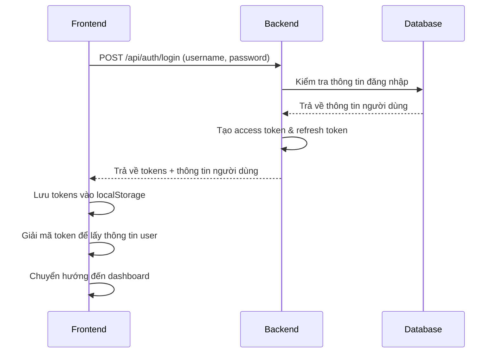
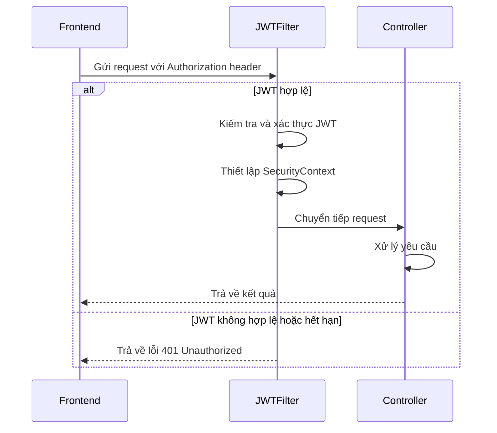
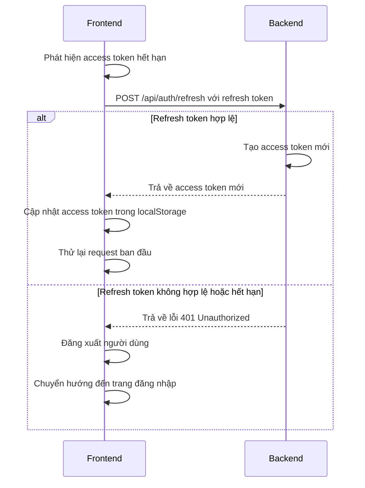
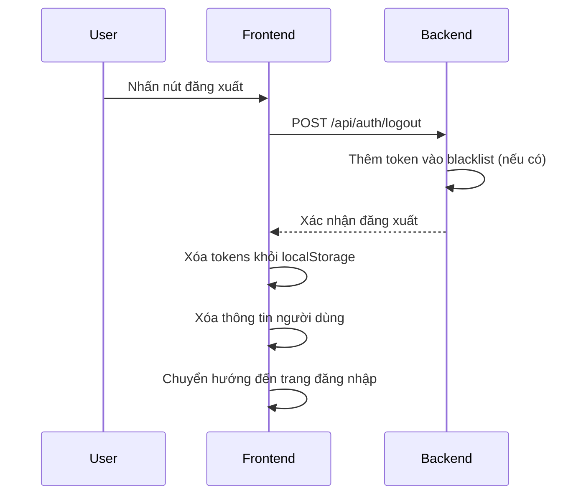

### Tài liệu Bảo trì Authentication Module

## Mục lục

1. [Tổng quan hệ thống](#1-tổng-quan-hệ-thống)
2. [Kiến trúc chi tiết](#2-kiến-trúc-chi-tiết)
3. [Luồng xác thực](#3-luồng-xác-thực)
4. [Cấu trúc mã nguồn](#4-cấu-trúc-mã-nguồn)
5. [Cấu hình hệ thống](#5-cấu-hình-hệ-thống)
6. [API Endpoints](#6-api-endpoints)
7. [Quản lý token](#7-quản-lý-token)
8. [Phân quyền](#8-phân-quyền)
9. [Bảo mật](#9-bảo-mật)
10. [Xử lý lỗi](#10-xử-lý-lỗi)
11. [Mở rộng hệ thống](#11-mở-rộng-hệ-thống)
12. [Khắc phục sự cố](#12-khắc-phục-sự-cố)
13. [Kiểm thử](#13-kiểm-thử)
14. [Tài liệu tham khảo](#14-tài-liệu-tham-khảo)


## 1. Tổng quan hệ thống

### 1.1 Giới thiệu

Authentication Module là hệ thống xác thực và phân quyền dựa trên JWT (JSON Web Token) được triển khai cho ứng dụng quản lý học sinh. Hệ thống bao gồm hai phần chính:

- **Backend**: Triển khai bằng Spring Boot, Spring Security và JWT
- **Frontend**: Triển khai bằng Next.js, React và TypeScript


### 1.2 Các tính năng chính

- Đăng nhập/đăng xuất
- Xác thực dựa trên JWT
- Phân quyền dựa trên vai trò (RBAC)
- Cơ chế refresh token
- Bảo vệ API endpoints
- Xử lý phiên đăng nhập trên nhiều tab
- Xử lý token hết hạn


### 1.3 Công nghệ sử dụng

**Backend:**

- Spring Boot 3.x
- Spring Security 6.x
- JWT (jsonwebtoken)
- JPA/Hibernate
- PostgreSQL


**Frontend:**

- Next.js 14.x
- React 18.x
- TypeScript 5.x
- Axios
- jwt-decode


## 2. Kiến trúc chi tiết

### 2.1 Kiến trúc tổng thể

```plaintext
┌─────────────────┐      ┌─────────────────┐      ┌─────────────────┐
│                 │      │                 │      │                 │
│    Frontend     │◄────►│    API Layer    │◄────►│    Database     │
│    (Next.js)    │      │  (Spring Boot)  │      │  (PostgreSQL)   │
│                 │      │                 │      │                 │
└─────────────────┘      └─────────────────┘      └─────────────────┘
```

### 2.2 Kiến trúc backend

```plaintext
┌─────────────────────────────────────────────────────────────────┐
│                        Spring Boot Application                  │
│                                                                 │
│  ┌─────────────┐    ┌─────────────┐    ┌─────────────────────┐  │
│  │             │    │             │    │                     │  │
│  │ Controllers │───►│  Services   │───►│     Repositories    │  │
│  │             │    │             │    │                     │  │
│  └─────────────┘    └─────────────┘    └─────────────────────┘  │
│         │                  │                      │             │
│         ▼                  ▼                      ▼             │
│  ┌─────────────┐    ┌─────────────┐    ┌─────────────────────┐  │
│  │             │    │             │    │                     │  │
│  │ JWT Filter  │◄───│ JWT Service │    │      Entities       │  │
│  │             │    │             │    │                     │  │
│  └─────────────┘    └─────────────┘    └─────────────────────┘  │
│                                                                 │
└─────────────────────────────────────────────────────────────────┘
```

### 2.3 Kiến trúc frontend

```plaintext
┌─────────────────────────────────────────────────────────────────┐
│                        Next.js Application                      │
│                                                                 │
│  ┌─────────────┐    ┌─────────────┐    ┌─────────────────────┐  │
│  │             │    │             │    │                     │  │
│  │   Pages     │───►│ Components  │───►│     API Client      │  │
│  │             │    │             │    │                     │  │
│  └─────────────┘    └─────────────┘    └─────────────────────┘  │
│         │                  │                      │             │
│         ▼                  ▼                      ▼             │
│  ┌─────────────┐    ┌─────────────┐    ┌─────────────────────┐  │
│  │             │    │             │    │                     │  │
│  │ Middleware  │◄───│ Auth Context│───►│   Token Storage     │  │
│  │             │    │             │    │                     │  │
│  └─────────────┘    └─────────────┘    └─────────────────────┘  │
│                                                                 │
└─────────────────────────────────────────────────────────────────┘
```

## 3. Luồng xác thực

### 3.1 Luồng đăng nhập



### 3.2 Luồng xác thực API



### 3.3 Luồng refresh token



### 3.4 Luồng đăng xuất



## 4. Cấu trúc mã nguồn

### 4.1 Cấu trúc backend

```plaintext
src/main/java/com/yourproject/auth/
├── config/
│   ├── SecurityConfig.java          # Cấu hình Spring Security
│   └── JwtAuthFilter.java           # Filter xác thực JWT
├── controller/
│   ├── AuthController.java          # API đăng nhập, refresh token, đăng xuất
│   └── UserController.java          # API quản lý người dùng
├── dto/
│   ├── LoginRequest.java            # DTO cho request đăng nhập
│   ├── LoginResponse.java           # DTO cho response đăng nhập
│   └── RefreshTokenRequest.java     # DTO cho request refresh token
├── exception/
│   └── AuthException.java           # Exception xử lý lỗi xác thực
├── model/
│   ├── User.java                    # Entity người dùng
│   └── TokenType.java               # Enum loại token
├── repository/
│   └── UserRepository.java          # Repository truy vấn dữ liệu người dùng
├── service/
│   ├── AuthService.java             # Service xử lý đăng nhập, refresh token
│   ├── JwtService.java              # Service tạo và xác thực JWT
│   └── UserDetailsServiceImpl.java  # Service load thông tin người dùng
└── util/
    └── SecurityConstants.java       # Các hằng số bảo mật
```

### 4.2 Cấu trúc frontend

```plaintext
src/
├── app/
│   ├── api/
│   │   └── auth/
│   │       ├── login/
│   │       │   └── route.ts         # API route xử lý đăng nhập
│   │       ├── refresh/
│   │       │   └── route.ts         # API route xử lý refresh token
│   │       └── logout/
│   │           └── route.ts         # API route xử lý đăng xuất
│   ├── login/
│   │   └── page.tsx                 # Trang đăng nhập
│   └── layout.tsx                   # Layout chính của ứng dụng
├── components/
│   ├── auth-provider.tsx            # Provider context xác thực
│   ├── login-form.tsx               # Form đăng nhập
│   ├── protected-route.tsx          # Component bảo vệ route
│   └── user-nav.tsx                 # Component hiển thị thông tin người dùng
├── lib/
│   └── auth.ts                      # Các hàm tiện ích xác thực
└── middleware.ts                    # Middleware xác thực route
```

## 5. Cấu hình hệ thống

### 5.1 Cấu hình backend

#### 5.1.1 application.properties/yml

```yaml
# JWT Configuration
jwt:
  secret: your-secret-key-at-least-256-bits-long-1234567890
  expiration: 86400000  # 1 day in milliseconds
  refresh-expiration: 604800000  # 7 days in milliseconds

# Security Configuration
spring:
  security:
    filter:
      order: 10
  datasource:
    url: jdbc:postgresql://localhost:5432/your_database
    username: your_username
    password: your_password
  jpa:
    hibernate:
      ddl-auto: update
    properties:
      hibernate:
        dialect: org.hibernate.dialect.PostgreSQLDialect
```

#### 5.1.2 SecurityConfig.java

```java
@Configuration
@EnableWebSecurity
public class SecurityConfig {
    
    @Autowired
    private JwtAuthFilter jwtAuthFilter;
    
    @Bean
    public SecurityFilterChain securityFilterChain(HttpSecurity http) throws Exception {
        http
            .csrf(AbstractHttpConfigurer::disable)
            .authorizeHttpRequests(auth -> auth
                .requestMatchers("/api/auth/**").permitAll()
                .requestMatchers("/api/admin/**").hasRole("admin")
                .requestMatchers("/api/teacher/**").hasAnyRole("teacher", "admin")
                .requestMatchers("/api/staff/**").hasAnyRole("staff", "admin")
                .anyRequest().authenticated()
            )
            .sessionManagement(session -> session
                .sessionCreationPolicy(SessionCreationPolicy.STATELESS)
            )
            .addFilterBefore(jwtAuthFilter, UsernamePasswordAuthenticationFilter.class);
        
        return http.build();
    }

    @Bean
    public PasswordEncoder passwordEncoder() {
        return new BCryptPasswordEncoder();
    }

    @Bean
    public AuthenticationManager authenticationManager(AuthenticationConfiguration config) throws Exception {
        return config.getAuthenticationManager();
    }
}
```

### 5.2 Cấu hình frontend

#### 5.2.1 .env.local

```plaintext
NEXT_PUBLIC_API_URL=http://localhost:8080/api
JWT_SECRET=your-secret-key-at-least-256-bits-long-1234567890
```

#### 5.2.2 next.config.js

```javascript
/** @type {import('next').NextConfig} */
const nextConfig = {
  reactStrictMode: true,
  async rewrites() {
    return [
      {
        source: '/api/:path*',
        destination: `${process.env.NEXT_PUBLIC_API_URL}/:path*`,
      },
    ];
  },
}

module.exports = nextConfig
```

## 6. API Endpoints

### 6.1 Authentication API

| Endpoint | Method | Request Body | Response | Description
|-----|-----|-----|-----|-----
| `/api/auth/login` | POST | `{ "username": "string", "password": "string" }` | `{ "accessToken": "string", "refreshToken": "string", "user": { "id": "string", "name": "string", "role": "string" } }` | Đăng nhập và lấy token
| `/api/auth/refresh` | POST | `{ "refreshToken": "string" }` | `{ "accessToken": "string" }` | Làm mới access token
| `/api/auth/logout` | POST | - | `{ "message": "string" }` | Đăng xuất


### 6.2 User API

| Endpoint | Method | Description | Required Role
|-----|-----|-----|-----|-----
| `/api/users/me` | GET | Lấy thông tin người dùng hiện tại | Any authenticated
| `/api/users` | GET | Lấy danh sách người dùng | admin
| `/api/users/{id}` | GET | Lấy thông tin người dùng theo ID | admin
| `/api/users` | POST | Tạo người dùng mới | admin
| `/api/users/{id}` | PUT | Cập nhật thông tin người dùng | admin
| `/api/users/{id}` | DELETE | Xóa người dùng | admin


## 7. Quản lý token

### 7.1 Cấu trúc JWT

#### 7.1.1 Access Token

```json
{
  "alg": "HS256",
  "typ": "JWT"
}
{
  "sub": "username",
  "id": "user_id",
  "name": "User Name",
  "role": "admin",
  "iat": 1625097600,
  "exp": 1625184000
}
```

#### 7.1.2 Refresh Token

```json
{
  "alg": "HS256",
  "typ": "JWT"
}
{
  "sub": "username",
  "id": "user_id",
  "iat": 1625097600,
  "exp": 1625702400
}
```

### 7.2 Lưu trữ token

#### 7.2.1 Frontend

Tokens được lưu trữ trong localStorage:

```javascript
// Lưu token
localStorage.setItem("accessToken", accessToken);
localStorage.setItem("refreshToken", refreshToken);

// Lấy token
const accessToken = localStorage.getItem("accessToken");
const refreshToken = localStorage.getItem("refreshToken");

// Xóa token
localStorage.removeItem("accessToken");
localStorage.removeItem("refreshToken");
```

#### 7.2.2 Backend

Tokens không được lưu trữ ở backend, nhưng có thể triển khai token blacklist để vô hiệu hóa tokens khi đăng xuất:

```java
@Service
public class TokenBlacklistService {
    private final Set<String> blacklistedTokens = new ConcurrentHashMap<String, Boolean>().keySet(true);
    private final ScheduledExecutorService scheduler = Executors.newScheduledThreadPool(1);
    
    public void blacklistToken(String token) {
        blacklistedTokens.add(token);
    }
    
    public boolean isBlacklisted(String token) {
        return blacklistedTokens.contains(token);
    }
    
    // Định kỳ xóa tokens hết hạn khỏi blacklist
    @PostConstruct
    public void scheduleCleanup() {
        scheduler.scheduleAtFixedRate(this::cleanupBlacklist, 1, 1, TimeUnit.DAYS);
    }
    
    private void cleanupBlacklist() {
        // Implement cleanup logic
    }
}
```

### 7.3 Xử lý token hết hạn

#### 7.3.1 Frontend

```javascript
// Kiểm tra token hết hạn
export const isTokenExpired = (token: string): boolean => {
  try {
    const decoded = jwtDecode<{ exp: number }>(token);
    const currentTime = Date.now() / 1000;
    return decoded.exp < currentTime;
  } catch {
    return true;
  }
}

// Refresh token khi access token hết hạn
const refreshToken = async (): Promise<string | null> => {
  try {
    const storedRefreshToken = getStoredRefreshToken();
    
    if (!storedRefreshToken) {
      return null;
    }
    
    const response = await apiClient.post("/auth/refresh", {
      refreshToken: storedRefreshToken
    });
    
    const { accessToken, refreshToken: newRefreshToken } = response.data;

    if (accessToken) {
      setStoredTokens(accessToken, newRefreshToken || storedRefreshToken);
      return accessToken;
    }

    return null;
  } catch (error) {
    console.error("Failed to refresh token:", error);
    return null;
  }
}
```

#### 7.3.2 Backend

```java
@Component
public class JwtAuthFilter extends OncePerRequestFilter {
    
    @Autowired
    private JwtService jwtService;
    
    @Autowired
    private UserDetailsServiceImpl userDetailsService;

    @Override
    protected void doFilterInternal(
            HttpServletRequest request,
            HttpServletResponse response,
            FilterChain filterChain
    ) throws ServletException, IOException {
        final String authHeader = request.getHeader("Authorization");
        final String jwt;
        final String username;
        
        if (authHeader == null || !authHeader.startsWith("Bearer ")) {
            filterChain.doFilter(request, response);
            return;
        }
        
        jwt = authHeader.substring(7);
        
        try {
            username = jwtService.extractUsername(jwt);
            
            if (username != null && SecurityContextHolder.getContext().getAuthentication() == null) {
                UserDetails userDetails = userDetailsService.loadUserByUsername(username);
                
                if (jwtService.isTokenValid(jwt, userDetails)) {
                    UsernamePasswordAuthenticationToken authToken = new UsernamePasswordAuthenticationToken(
                        userDetails,
                        null,
                        userDetails.getAuthorities()
                    );
                    authToken.setDetails(new WebAuthenticationDetailsSource().buildDetails(request));
                    SecurityContextHolder.getContext().setAuthentication(authToken);
                }
            }
        } catch (ExpiredJwtException e) {
            // Token hết hạn, không thiết lập SecurityContext
            // Client sẽ nhận được lỗi 401 và cần refresh token
        } catch (JwtException e) {
            // Token không hợp lệ
            response.setStatus(HttpServletResponse.SC_UNAUTHORIZED);
            response.getWriter().write("Invalid JWT token");
            return;
        }
        
        filterChain.doFilter(request, response);
    }
}
```

## 8. Phân quyền

### 8.1 Vai trò (Roles)

Hệ thống hỗ trợ 3 vai trò chính:

1. **admin**: Quản trị viên, có toàn quyền truy cập
2. **teacher**: Giáo viên, có quyền truy cập các tính năng giảng dạy
3. **staff**: Nhân viên, có quyền truy cập các tính năng hành chính


### 8.2 Phân quyền backend

#### 8.2.1 Cấu hình phân quyền

```java
@Configuration
@EnableWebSecurity
public class SecurityConfig {
    
    // ...
    
    @Bean
    public SecurityFilterChain securityFilterChain(HttpSecurity http) throws Exception {
        http
            .csrf(AbstractHttpConfigurer::disable)
            .authorizeHttpRequests(auth -> auth
                .requestMatchers("/api/auth/**").permitAll()
                .requestMatchers("/api/admin/**").hasRole("admin")
                .requestMatchers("/api/teacher/**").hasAnyRole("teacher", "admin")
                .requestMatchers("/api/staff/**").hasAnyRole("staff", "admin")
                .requestMatchers("/api/students/**").hasAnyRole("teacher", "staff", "admin")
                .requestMatchers("/api/classes/**").hasAnyRole("teacher", "staff", "admin")
                .anyRequest().authenticated()
            )
            // ...
        
        return http.build();
    }
    
    // ...
}
```

#### 8.2.2 Phân quyền ở mức controller

```java
@RestController
@RequestMapping("/api/students")
public class StudentController {
    
    @GetMapping
    @PreAuthorize("hasAnyRole('teacher', 'staff', 'admin')")
    public List<Student> getAllStudents() {
        // ...
    }
    
    @PostMapping
    @PreAuthorize("hasAnyRole('staff', 'admin')")
    public Student createStudent(@RequestBody Student student) {
        // ...
    }
    
    @DeleteMapping("/{id}")
    @PreAuthorize("hasRole('admin')")
    public void deleteStudent(@PathVariable Long id) {
        // ...
    }
}
```

### 8.3 Phân quyền frontend

#### 8.3.1 ProtectedRoute component

```typescriptreact
interface ProtectedRouteProps {
  children: React.ReactNode
  requiredRoles?: string[]
}

export function ProtectedRoute({ children, requiredRoles }: ProtectedRouteProps) {
  const { user, isLoading, checkAuth } = useAuth()
  const router = useRouter()

  useEffect(() => {
    const verifyAuth = async () => {
      const isAuthenticated = await checkAuth()
      if (!isAuthenticated && !isLoading) {
        router.push("/login")
      }
    }

    verifyAuth()
  }, [checkAuth, isLoading, router])

  // Kiểm tra quyền hạn nếu có yêu cầu
  const hasRequiredRole = () => {
    if (!requiredRoles || requiredRoles.length === 0) return true;
    if (!user) return false;
    
    return requiredRoles.includes(user.role);
  }

  if (isLoading) {
    return <LoadingSpinner />
  }

  if (!user) {
    return null // Router will redirect
  }

  if (!hasRequiredRole()) {
    return <AccessDenied />
  }

  return <>{children}</>
}
```

#### 8.3.2 Sử dụng ProtectedRoute

```typescriptreact
// Chỉ cho phép admin truy cập
<ProtectedRoute requiredRoles={["admin"]}>
  <AdminPage />
</ProtectedRoute>

// Cho phép cả admin và teacher truy cập
<ProtectedRoute requiredRoles={["admin", "teacher"]}>
  <TeacherPage />
</ProtectedRoute>
```

#### 8.3.3 Hiển thị/ẩn UI dựa trên vai trò

```typescriptreact
function AdminButton() {
  const { user } = useAuth();
  
  if (user?.role !== 'admin') {
    return null;
  }
  
  return <Button>Admin Action</Button>;
}
```

## 9. Bảo mật

### 9.1 Bảo mật JWT

#### 9.1.1 Sử dụng khóa bí mật mạnh

```java
// Sử dụng khóa bí mật có độ dài ít nhất 256 bit
public static final String JWT_SECRET = "your-secret-key-at-least-256-bits-long-1234567890";
```

#### 9.1.2 Thiết lập thời gian hết hạn hợp lý

```java
// Access token có thời gian ngắn (15 phút - 1 giờ)
public static final long JWT_EXPIRATION = 900000; // 15 phút

// Refresh token có thời gian dài hơn (1-7 ngày)
public static final long REFRESH_EXPIRATION = 604800000; // 7 ngày
```

#### 9.1.3 Sử dụng thuật toán mã hóa mạnh

```java
private Key getSignInKey() {
    byte[] keyBytes = Decoders.BASE64.decode(SecurityConstants.JWT_SECRET);
    return Keys.hmacShaKeyFor(keyBytes);
}

public String generateToken(UserDetails userDetails, TokenType tokenType) {
    long expiration = tokenType == TokenType.ACCESS 
        ? SecurityConstants.JWT_EXPIRATION 
        : SecurityConstants.REFRESH_EXPIRATION;
    
    return Jwts.builder()
            .setSubject(userDetails.getUsername())
            .setIssuedAt(new Date())
            .setExpiration(new Date(System.currentTimeMillis() + expiration))
            .signWith(getSignInKey(), SignatureAlgorithm.HS256)
            .compact();
}
```

### 9.2 Bảo mật mật khẩu

```java
@Bean
public PasswordEncoder passwordEncoder() {
    return new BCryptPasswordEncoder(12); // Độ phức tạp cao
}

// Khi tạo người dùng mới
user.setPassword(passwordEncoder.encode(rawPassword));
```

### 9.3 Bảo vệ khỏi các cuộc tấn công phổ biến

#### 9.3.1 CSRF Protection

```java
// Vô hiệu hóa CSRF cho API stateless
http.csrf(AbstractHttpConfigurer::disable)
```

#### 9.3.2 XSS Protection

```java
// Sử dụng Content-Security-Policy
@Bean
public WebMvcConfigurer corsConfigurer() {
    return new WebMvcConfigurer() {
        @Override
        public void addCorsMappings(CorsRegistry registry) {
            registry.addMapping("/**")
                .allowedOrigins("https://your-frontend-domain.com")
                .allowedMethods("GET", "POST", "PUT", "DELETE")
                .allowedHeaders("*")
                .exposedHeaders("Authorization")
                .allowCredentials(true);
        }
    };
}
```

#### 9.3.3 Rate Limiting

```java
@Component
public class RateLimitingFilter extends OncePerRequestFilter {
    private final Map<String, Integer> requestCounts = new ConcurrentHashMap<>();
    private final Map<String, Long> blockUntil = new ConcurrentHashMap<>();
    
    private static final int MAX_REQUESTS = 60; // 60 requests
    private static final int WINDOW_SIZE_MS = 60000; // per minute
    private static final int BLOCK_DURATION_MS = 300000; // 5 minutes
    
    @Override
    protected void doFilterInternal(HttpServletRequest request, HttpServletResponse response, FilterChain filterChain)
            throws ServletException, IOException {
        
        String clientIp = getClientIp(request);
        
        // Check if client is blocked
        if (blockUntil.containsKey(clientIp) && blockUntil.get(clientIp) > System.currentTimeMillis()) {
            response.setStatus(HttpServletResponse.SC_TOO_MANY_REQUESTS);
            response.getWriter().write("Too many requests. Please try again later.");
            return;
        }
        
        // Increment request count
        int count = requestCounts.compute(clientIp, (key, val) -> val == null ? 1 : val + 1);
        
        // If first request in window, schedule cleanup
        if (count == 1) {
            scheduleCleanup(clientIp);
        }
        
        // Check if rate limit exceeded
        if (count > MAX_REQUESTS) {
            blockUntil.put(clientIp, System.currentTimeMillis() + BLOCK_DURATION_MS);
            response.setStatus(HttpServletResponse.SC_TOO_MANY_REQUESTS);
            response.getWriter().write("Rate limit exceeded. Please try again later.");
            return;
        }
        
        filterChain.doFilter(request, response);
    }
    
    private String getClientIp(HttpServletRequest request) {
        String xForwardedFor = request.getHeader("X-Forwarded-For");
        if (xForwardedFor != null && !xForwardedFor.isEmpty()) {
            return xForwardedFor.split(",")[0].trim();
        }
        return request.getRemoteAddr();
    }
    
    private void scheduleCleanup(String clientIp) {
        new Timer().schedule(new TimerTask() {
            @Override
            public void run() {
                requestCounts.remove(clientIp);
            }
        }, WINDOW_SIZE_MS);
    }
}
```

## 10. Xử lý lỗi

### 10.1 Xử lý lỗi backend

```java
@RestControllerAdvice
public class GlobalExceptionHandler {
    
    @ExceptionHandler(AuthException.class)
    public ResponseEntity<ErrorResponse> handleAuthException(AuthException ex) {
        ErrorResponse error = new ErrorResponse(
            HttpStatus.UNAUTHORIZED.value(),
            ex.getMessage(),
            LocalDateTime.now()
        );
        return new ResponseEntity<>(error, HttpStatus.UNAUTHORIZED);
    }
    
    @ExceptionHandler(AccessDeniedException.class)
    public ResponseEntity<ErrorResponse> handleAccessDeniedException(AccessDeniedException ex) {
        ErrorResponse error = new ErrorResponse(
            HttpStatus.FORBIDDEN.value(),
            "Bạn không có quyền truy cập tài nguyên này",
            LocalDateTime.now()
        );
        return new ResponseEntity<>(error, HttpStatus.FORBIDDEN);
    }
    
    @ExceptionHandler(Exception.class)
    public ResponseEntity<ErrorResponse> handleGlobalException(Exception ex) {
        ErrorResponse error = new ErrorResponse(
            HttpStatus.INTERNAL_SERVER_ERROR.value(),
            "Đã xảy ra lỗi hệ thống",
            LocalDateTime.now()
        );
        return new ResponseEntity<>(error, HttpStatus.INTERNAL_SERVER_ERROR);
    }
}

@Data
@AllArgsConstructor
public class ErrorResponse {
    private int status;
    private String message;
    private LocalDateTime timestamp;
}
```

### 10.2 Xử lý lỗi frontend

```typescript
// Interceptor xử lý lỗi
apiClient.interceptors.response.use(
  (response) => response,
  async (error) => {
    const originalRequest = error.config

    // Nếu lỗi 401 và chưa thử refresh token
    if (error.response?.status === 401 && !originalRequest._retry) {
      originalRequest._retry = true

      try {
        // Thử refresh token
        const newToken = await refreshToken()

        if (newToken) {
          // Cập nhật token trong header và thử lại request
          originalRequest.headers["Authorization"] = `Bearer ${newToken}`
          return apiClient(originalRequest)
        } else {
          // Nếu không refresh được, đăng xuất
          await logoutFn()
          return Promise.reject(error)
        }
      } catch (refreshError) {
        // Nếu refresh lỗi, đăng xuất
        await logoutFn()
        return Promise.reject(refreshError)
      }
    }

    // Xử lý các lỗi khác
    if (error.response?.status === 403) {
      // Hiển thị thông báo không có quyền truy cập
      toast({
        title: "Không có quyền truy cập",
        description: "Bạn không có quyền thực hiện hành động này",
        variant: "destructive",
      })
    } else if (error.response?.status === 429) {
      // Hiển thị thông báo quá nhiều yêu cầu
      toast({
        title: "Quá nhiều yêu cầu",
        description: "Vui lòng thử lại sau ít phút",
        variant: "destructive",
      })
    } else {
      // Hiển thị thông báo lỗi chung
      toast({
        title: "Đã xảy ra lỗi",
        description: error.response?.data?.message || "Vui lòng thử lại sau",
        variant: "destructive",
      })
    }

    return Promise.reject(error)
  }
)
```

## 11. Mở rộng hệ thống

### 11.1 Thêm vai trò mới

#### 11.1.1 Backend

1. Thêm vai trò mới vào enum hoặc bảng vai trò:


```java
public enum Role {
    ADMIN("admin"),
    TEACHER("teacher"),
    STAFF("staff"),
    STUDENT("student"); // Vai trò mới
    
    private final String value;
    
    Role(String value) {
        this.value = value;
    }
    
    public String getValue() {
        return value;
    }
}
```

2. Cập nhật cấu hình phân quyền:


```java
@Configuration
@EnableWebSecurity
public class SecurityConfig {
    
    @Bean
    public SecurityFilterChain securityFilterChain(HttpSecurity http) throws Exception {
        http
            .csrf(AbstractHttpConfigurer::disable)
            .authorizeHttpRequests(auth -> auth
                // ...
                .requestMatchers("/api/student/**").hasRole("student") // Endpoint mới
                // ...
            )
            // ...
        
        return http.build();
    }
}
```

#### 11.1.2 Frontend

1. Cập nhật hiển thị vai trò trong UserNav:


```typescriptreact
// Xác định role hiển thị
const roleDisplay = () => {
  switch (user?.role) {
    case 'admin':
      return 'Quản trị viên';
    case 'teacher':
      return 'Giáo viên';
    case 'staff':
      return 'Nhân viên';
    case 'student':
      return 'Học sinh'; // Vai trò mới
    default:
      return user?.role || '';
  }
}
```

2. Sử dụng vai trò mới trong ProtectedRoute:


```typescriptreact
<ProtectedRoute requiredRoles={["student"]}>
  <StudentDashboard />
</ProtectedRoute>
```

### 11.2 Thêm xác thực 2 yếu tố (2FA)

#### 11.2.1 Backend

1. Thêm dependencies:


```xml
<dependency>
    <groupId>dev.samstevens.totp</groupId>
    <artifactId>totp</artifactId>
    <version>1.7.1</version>
</dependency>
```

2. Thêm service xử lý 2FA:


```java
@Service
public class TwoFactorAuthService {
    
    private final TimeBasedOneTimePasswordGenerator totp = new TimeBasedOneTimePasswordGenerator();
    private final QrDataFactory qrDataFactory = new DefaultQrDataFactory();
    private final QrGenerator qrGenerator = new ZxingPngQrGenerator();
    
    public String generateSecretKey() {
        return Base32.random();
    }
    
    public String generateQrCodeImageUri(String secretKey, String username) {
        QrData data = qrDataFactory.newBuilder()
            .label(username)
            .secret(secretKey)
            .issuer("Your Application")
            .build();
        
        try {
            return qrGenerator.generate(data);
        } catch (QrGenerationException e) {
            throw new RuntimeException("Error generating QR code", e);
        }
    }
    
    public boolean validateCode(String code, String secretKey) {
        return totp.verify(code, secretKey);
    }
}
```

3. Cập nhật User entity:


```java
@Entity
public class User {
    // ...
    
    @Column(name = "two_factor_enabled")
    private boolean twoFactorEnabled;
    
    @Column(name = "two_factor_secret")
    private String twoFactorSecret;
    
    // ...
}
```

4. Cập nhật AuthController:


```java
@RestController
@RequestMapping("/api/auth")
public class AuthController {
    
    // ...
    
    @PostMapping("/login")
    public ResponseEntity<?> login(@RequestBody LoginRequest request) {
        User user = userService.findByUsername(request.getUsername());
        
        if (user != null && passwordEncoder.matches(request.getPassword(), user.getPassword())) {
            if (user.isTwoFactorEnabled()) {
                // Trả về yêu cầu xác thực 2FA
                return ResponseEntity.ok(new TwoFactorRequiredResponse(user.getId()));
            } else {
                // Đăng nhập bình thường
                return ResponseEntity.ok(authService.authenticate(request));
            }
        }
        
        return ResponseEntity.status(HttpStatus.UNAUTHORIZED).body(new ErrorResponse("Invalid credentials"));
    }
    
    @PostMapping("/verify-2fa")
    public ResponseEntity<?> verifyTwoFactor(@RequestBody TwoFactorVerifyRequest request) {
        User user = userService.findById(request.getUserId());
        
        if (user != null && twoFactorAuthService.validateCode(request.getCode(), user.getTwoFactorSecret())) {
            // Xác thực 2FA thành công, tạo token
            return ResponseEntity.ok(authService.generateTokens(user));
        }
        
        return ResponseEntity.status(HttpStatus.UNAUTHORIZED).body(new ErrorResponse("Invalid 2FA code"));
    }
    
    @PostMapping("/setup-2fa")
    @PreAuthorize("isAuthenticated()")
    public ResponseEntity<?> setupTwoFactor() {
        User user = userService.getCurrentUser();
        String secretKey = twoFactorAuthService.generateSecretKey();
        
        user.setTwoFactorSecret(secretKey);
        userService.save(user);
        
        String qrCodeUri = twoFactorAuthService.generateQrCodeImageUri(secretKey, user.getUsername());
        
        return ResponseEntity.ok(new TwoFactorSetupResponse(secretKey, qrCodeUri));
    }
    
    @PostMapping("/enable-2fa")
    @PreAuthorize("isAuthenticated()")
    public ResponseEntity<?> enableTwoFactor(@RequestBody TwoFactorEnableRequest request) {
        User user = userService.getCurrentUser();
        
        if (twoFactorAuthService.validateCode(request.getCode(), user.getTwoFactorSecret())) {
            user.setTwoFactorEnabled(true);
            userService.save(user);
            return ResponseEntity.ok(new SuccessResponse("Two-factor authentication enabled"));
        }
        
        return ResponseEntity.status(HttpStatus.BAD_REQUEST).body(new ErrorResponse("Invalid 2FA code"));
    }
    
    // ...
}
```

#### 11.2.2 Frontend

1. Thêm components xác thực 2FA:


```typescriptreact
// components/two-factor-form.tsx
"use client"

import { useState } from "react"
import { useForm } from "react-hook-form"
import { zodResolver } from "@hookform/resolvers/zod"
import { z } from "zod"
import { Button } from "@/components/ui/button"
import { Form, FormControl, FormField, FormItem, FormLabel, FormMessage } from "@/components/ui/form"
import { Input } from "@/components/ui/input"
import { useToast } from "@/components/ui/use-toast"
import { apiClient } from "@/lib/auth"

const twoFactorSchema = z.object({
  code: z.string().length(6, { message: "Mã xác thực phải có 6 chữ số" }),
})

interface TwoFactorFormProps {
  userId: string
  onSuccess: (response: any) => void
}

export function TwoFactorForm({ userId, onSuccess }: TwoFactorFormProps) {
  const [isSubmitting, setIsSubmitting] = useState(false)
  const { toast } = useToast()
  
  const form = useForm<z.infer<typeof twoFactorSchema>>({
    resolver: zodResolver(twoFactorSchema),
    defaultValues: {
      code: "",
    },
  })
  
  async function onSubmit(values: z.infer<typeof twoFactorSchema>) {
    setIsSubmitting(true)
    
    try {
      const response = await apiClient.post("/auth/verify-2fa", {
        userId,
        code: values.code,
      })
      
      onSuccess(response.data)
    } catch (error: any) {
      toast({
        variant: "destructive",
        title: "Xác thực thất bại",
        description: error.response?.data?.message || "Mã xác thực không đúng",
      })
    } finally {
      setIsSubmitting(false)
    }
  }
  
  return (
    <Form {...form}>
      <form onSubmit={form.handleSubmit(onSubmit)} className="space-y-6">
        <FormField
          control={form.control}
          name="code"
          render={({ field }) => (
            <FormItem>
              <FormLabel>Mã xác thực 2FA</FormLabel>
              <FormControl>
                <Input
                  placeholder="Nhập mã 6 chữ số từ ứng dụng xác thực"
                  {...field}
                  maxLength={6}
                />
              </FormControl>
              <FormMessage />
            </FormItem>
          )}
        />
        
        <Button type="submit" className="w-full bg-red-700 hover:bg-red-800" disabled={isSubmitting}>
          {isSubmitting ? "Đang xác thực..." : "Xác thực"}
        </Button>
      </form>
    </Form>
  )
}
```

2. Cập nhật luồng đăng nhập:


```typescriptreact
// components/login-form.tsx
"use client"

import { useState } from "react"
// ...
import { TwoFactorForm } from "@/components/two-factor-form"

export function LoginForm() {
  // ...
  const [twoFactorRequired, setTwoFactorRequired] = useState(false)
  const [userId, setUserId] = useState<string | null>(null)
  
  async function onSubmit(values: z.infer<typeof formSchema>) {
    setIsSubmitting(true)
    
    try {
      const response = await apiClient.post("/auth/login", values)
      
      // Kiểm tra xem có yêu cầu 2FA không
      if (response.data.requireTwoFactor) {
        setTwoFactorRequired(true)
        setUserId(response.data.userId)
        setIsSubmitting(false)
        return
      }
      
      // Đăng nhập thành công
      handleLoginSuccess(response.data)
    } catch (error: any) {
      // ...
    } finally {
      setIsSubmitting(false)
    }
  }
  
  function handleTwoFactorSuccess(data: any) {
    // Xử lý đăng nhập sau khi xác thực 2FA thành công
    handleLoginSuccess(data)
  }
  
  function handleLoginSuccess(data: any) {
    // Lưu token và chuyển hướng
    setStoredTokens(data.accessToken, data.refreshToken)
    router.push("/dashboard")
  }
  
  if (twoFactorRequired && userId) {
    return (
      <div className="space-y-6">
        <div className="text-center">
          <h2 className="text-2xl font-bold">Xác thực hai yếu tố</h2>
          <p className="text-sm text-muted-foreground">
            Vui lòng nhập mã xác thực từ ứng dụng của bạn
          </p>
        </div>
        
        <TwoFactorForm userId={userId} onSuccess={handleTwoFactorSuccess} />
      </div>
    )
  }
  
  return (
    <Form {...form}>
      {/* Form đăng nhập */}
    </Form>
  )
}
```

### 11.3 Thêm đăng nhập bằng mạng xã hội

#### 11.3.1 Backend

1. Thêm dependencies:


```xml
<dependency>
    <groupId>org.springframework.boot</groupId>
    <artifactId>spring-boot-starter-oauth2-client</artifactId>
</dependency>
```

2. Cấu hình OAuth2:


```yaml
spring:
  security:
    oauth2:
      client:
        registration:
          google:
            client-id: your-google-client-id
            client-secret: your-google-client-secret
            scope: email, profile
          facebook:
            client-id: your-facebook-client-id
            client-secret: your-facebook-client-secret
            scope: email, public_profile
```

3. Cập nhật SecurityConfig:


```java
@Configuration
@EnableWebSecurity
public class SecurityConfig {
    
    @Autowired
    private OAuth2UserService oAuth2UserService;
    
    @Autowired
    private OAuth2AuthenticationSuccessHandler oAuth2AuthenticationSuccessHandler;
    
    @Bean
    public SecurityFilterChain securityFilterChain(HttpSecurity http) throws Exception {
        http
            // ...
            .oauth2Login(oauth2 -> oauth2
                .userInfoEndpoint(userInfo -> userInfo
                    .userService(oAuth2UserService)
                )
                .successHandler(oAuth2AuthenticationSuccessHandler)
            )
            // ...
        
        return http.build();
    }
}
```

4. Tạo service xử lý OAuth2:


```java
@Service
public class OAuth2UserService extends DefaultOAuth2UserService {
    
    @Autowired
    private UserRepository userRepository;
    
    @Override
    public OAuth2User loadUser(OAuth2UserRequest userRequest) throws OAuth2AuthenticationException {
        OAuth2User oAuth2User = super.loadUser(userRequest);
        
        String provider = userRequest.getClientRegistration().getRegistrationId();
        String providerId = oAuth2User.getAttribute("sub"); // Google
        
        if ("facebook".equals(provider)) {
            providerId = oAuth2User.getAttribute("id");
        }
        
        // Tìm hoặc tạo user
        User user = userRepository.findByProviderAndProviderId(provider, providerId)
            .orElseGet(() -> createUser(oAuth2User, provider, providerId));
        
        return new CustomOAuth2User(oAuth2User, user);
    }
    
    private User createUser(OAuth2User oAuth2User, String provider, String providerId) {
        String email = oAuth2User.getAttribute("email");
        String name = oAuth2User.getAttribute("name");
        
        User user = new User();
        user.setUsername(email);
        user.setName(name);
        user.setProvider(provider);
        user.setProviderId(providerId);
        user.setRole("user"); // Vai trò mặc định
        
        return userRepository.save(user);
    }
}
```

5. Tạo handler xử lý đăng nhập thành công:


```java
@Component
public class OAuth2AuthenticationSuccessHandler extends SimpleUrlAuthenticationSuccessHandler {
    
    @Autowired
    private JwtService jwtService;
    
    @Override
    public void onAuthenticationSuccess(HttpServletRequest request, HttpServletResponse response,
                                       Authentication authentication) throws IOException, ServletException {
        
        CustomOAuth2User oAuth2User = (CustomOAuth2User) authentication.getPrincipal();
        User user = oAuth2User.getUser();
        
        String accessToken = jwtService.generateToken(user, TokenType.ACCESS);
        String refreshToken = jwtService.generateToken(user, TokenType.REFRESH);
        
        // Redirect to frontend with tokens
        String targetUrl = UriComponentsBuilder.fromUriString("/oauth2/redirect")
            .queryParam("accessToken", accessToken)
            .queryParam("refreshToken", refreshToken)
            .build().toUriString();
        
        getRedirectStrategy().sendRedirect(request, response, targetUrl);
    }
}
```

#### 11.3.2 Frontend

1. Thêm components đăng nhập bằng mạng xã hội:


```typescriptreact
// components/social-login.tsx
"use client"

import { Button } from "@/components/ui/button"
import { Separator } from "@/components/ui/separator"

export function SocialLogin() {
  return (
    <div className="space-y-4">
      <div className="relative">
        <div className="absolute inset-0 flex items-center">
          <Separator className="w-full" />
        </div>
        <div className="relative flex justify-center text-xs uppercase">
          <span className="bg-white px-2 text-muted-foreground">
            Hoặc đăng nhập với
          </span>
        </div>
      </div>
      
      <div className="grid grid-cols-2 gap-4">
        <Button variant="outline" onClick={() => window.location.href = "/api/auth/oauth2/authorization/google"}>
          <svg className="mr-2 h-4 w-4" viewBox="0 0 24 24">
            {/* Google icon */}
          </svg>
          Google
        </Button>
        
        <Button variant="outline" onClick={() => window.location.href = "/api/auth/oauth2/authorization/facebook"}>
          <svg className="mr-2 h-4 w-4" viewBox="0 0 24 24">
            {/* Facebook icon */}
          </svg>
          Facebook
        </Button>
      </div>
    </div>
  )
}
```

2. Thêm trang xử lý redirect sau khi đăng nhập:


```typescriptreact
// app/oauth2/redirect/page.tsx
"use client"

import { useEffect } from "react"
import { useRouter, useSearchParams } from "next/navigation"
import { setStoredTokens } from "@/lib/auth"
import { Loader2 } from 'lucide-react'

export default function OAuth2RedirectPage() {
  const router = useRouter()
  const searchParams = useSearchParams()
  
  useEffect(() => {
    const accessToken = searchParams.get("accessToken")
    const refreshToken = searchParams.get("refreshToken")
    
    if (accessToken && refreshToken) {
      // Lưu tokens
      setStoredTokens(accessToken, refreshToken)
      
      // Chuyển hướng đến dashboard
      router.push("/dashboard")
    } else {
      // Xử lý lỗi
      router.push("/login?error=oauth2_failed")
    }
  }, [router, searchParams])
  
  return (
    <div className="flex h-screen w-full items-center justify-center">
      <div className="flex flex-col items-center gap-2">
        <Loader2 className="h-8 w-8 animate-spin text-red-700" />
        <p className="text-sm text-muted-foreground">Đang xử lý đăng nhập...</p>
      </div>
    </div>
  )
}
```

3. Cập nhật trang đăng nhập:


```typescriptreact
// app/login/page.tsx
import { LoginForm } from "@/components/login-form"
import { SocialLogin } from "@/components/social-login"
import Image from "next/image"

export default function LoginPage() {
  return (
    <div className="flex min-h-screen flex-col items-center justify-center bg-gradient-to-br from-red-50 to-white p-4 md:p-8">
      <div className="w-full max-w-md rounded-xl border border-gray-200 bg-white p-6 shadow-lg md:p-8">
        <div className="mb-6 flex flex-col items-center">
          <div className="relative h-20 w-20 overflow-hidden rounded-full">
            <Image
              src="/placeholder.svg?height=80&width=80"
              alt="Logo Trung tâm Ánh Bình Minh"
              width={80}
              height={80}
              className="object-cover"
            />
          </div>
          <h1 className="mt-4 text-2xl font-bold text-red-700">Trung tâm Ánh Bình Minh</h1>
          <p className="text-sm text-gray-500">Hệ thống quản lý học sinh</p>
        </div>
        <LoginForm />
        <SocialLogin />
      </div>
    </div>
  )
}
```

## 12. Khắc phục sự cố

### 12.1 Lỗi xác thực

#### 12.1.1 Không thể đăng nhập

**Triệu chứng**: Người dùng không thể đăng nhập, nhận thông báo lỗi "Tên đăng nhập hoặc mật khẩu không đúng".

**Nguyên nhân có thể**:

1. Thông tin đăng nhập không chính xác
2. Tài khoản bị khóa
3. Lỗi kết nối cơ sở dữ liệu


**Cách khắc phục**:

1. Kiểm tra logs để xem lỗi chi tiết
2. Xác minh thông tin đăng nhập trong cơ sở dữ liệu
3. Kiểm tra trạng thái tài khoản
4. Kiểm tra kết nối cơ sở dữ liệu


```java
// Kiểm tra logs
@Slf4j
public class AuthService {
    public LoginResponse authenticate(LoginRequest request) {
        try {
            // ...
        } catch (Exception e) {
            log.error("Authentication error for user {}: {}", request.getUsername(), e.getMessage());
            throw e;
        }
    }
}
```

#### 12.1.2 Token không hợp lệ

**Triệu chứng**: API trả về lỗi 401 Unauthorized mặc dù người dùng đã đăng nhập.

**Nguyên nhân có thể**:

1. Token hết hạn
2. Token không hợp lệ
3. Token bị thay đổi
4. Khóa bí mật không khớp


**Cách khắc phục**:

1. Kiểm tra thời gian hết hạn của token
2. Xác minh token có đúng định dạng không
3. Kiểm tra khóa bí mật được sử dụng để ký token
4. Đảm bảo refresh token hoạt động đúng


```java
// Kiểm tra token
try {
    Claims claims = Jwts.parserBuilder()
            .setSigningKey(getSignInKey())
            .build()
            .parseClaimsJws(token)
            .getBody();
    
    System.out.println("Token subject: " + claims.getSubject());
    System.out.println("Token expiration: " + claims.getExpiration());
    System.out.println("Token issued at: " + claims.getIssuedAt());
} catch (ExpiredJwtException e) {
    System.out.println("Token expired");
} catch (JwtException e) {
    System.out.println("Invalid token: " + e.getMessage());
}
```

#### 12.1.3 Refresh token không hoạt động

**Triệu chứng**: Không thể làm mới access token khi hết hạn.

**Nguyên nhân có thể**:

1. Refresh token hết hạn
2. Refresh token không hợp lệ
3. Refresh token bị thay đổi
4. Lỗi trong quá trình xử lý refresh token


**Cách khắc phục**:

1. Kiểm tra thời gian hết hạn của refresh token
2. Xác minh refresh token có đúng định dạng không
3. Kiểm tra logs để xem lỗi chi tiết
4. Đảm bảo endpoint refresh token hoạt động đúng


```typescript
// Kiểm tra refresh token
const checkRefreshToken = async () => {
  const refreshToken = getStoredRefreshToken();
  
  if (!refreshToken) {
    console.log("No refresh token found");
    return;
  }
  
  try {
    const decoded = jwtDecode(refreshToken);
    console.log("Refresh token payload:", decoded);
    
    const currentTime = Date.now() / 1000;
    if (decoded.exp < currentTime) {
      console.log("Refresh token expired");
    } else {
      console.log("Refresh token valid until:", new Date(decoded.exp * 1000));
    }
  } catch (error) {
    console.log("Invalid refresh token:", error);
  }
}
```

### 12.2 Lỗi phân quyền

#### 12.2.1 Không có quyền truy cập

**Triệu chứng**: Người dùng nhận được lỗi 403 Forbidden khi truy cập tài nguyên.

**Nguyên nhân có thể**:

1. Người dùng không có vai trò cần thiết
2. Cấu hình phân quyền không chính xác
3. Token không chứa thông tin vai trò


**Cách khắc phục**:

1. Kiểm tra vai trò của người dùng trong cơ sở dữ liệu
2. Xác minh cấu hình phân quyền
3. Kiểm tra token có chứa thông tin vai trò không
4. Đảm bảo JwtAuthFilter trích xuất đúng thông tin vai trò


```java
// Kiểm tra vai trò
@GetMapping("/check-role")
public ResponseEntity<?> checkRole(Authentication authentication) {
    UserDetails userDetails = (UserDetails) authentication.getPrincipal();
    
    Map<String, Object> response = new HashMap<>();
    response.put("username", userDetails.getUsername());
```