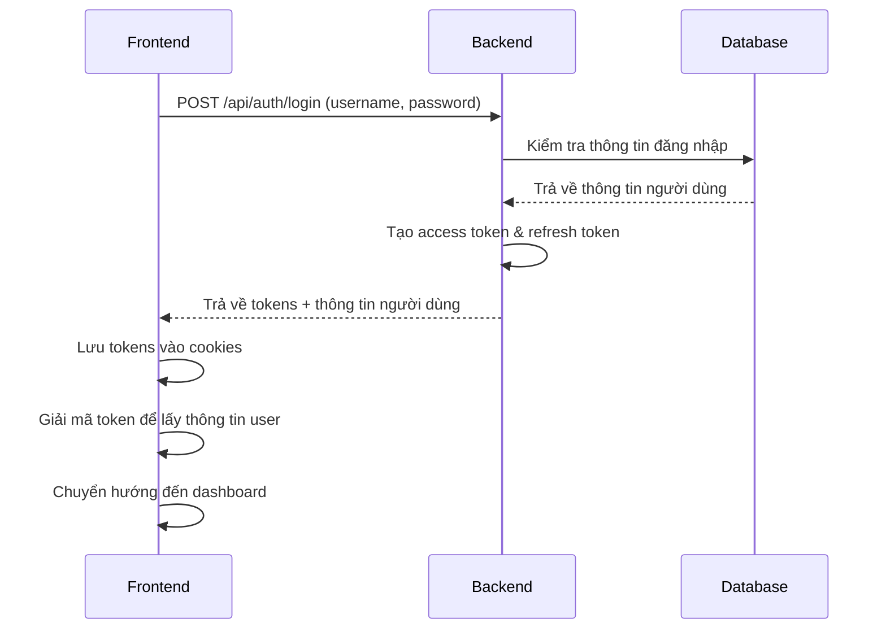
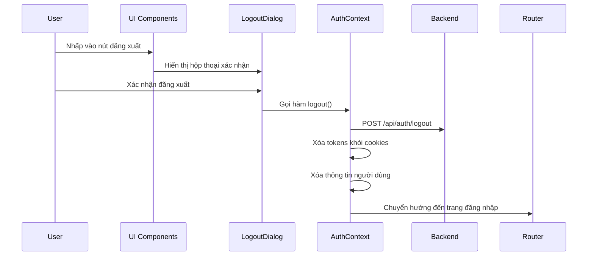
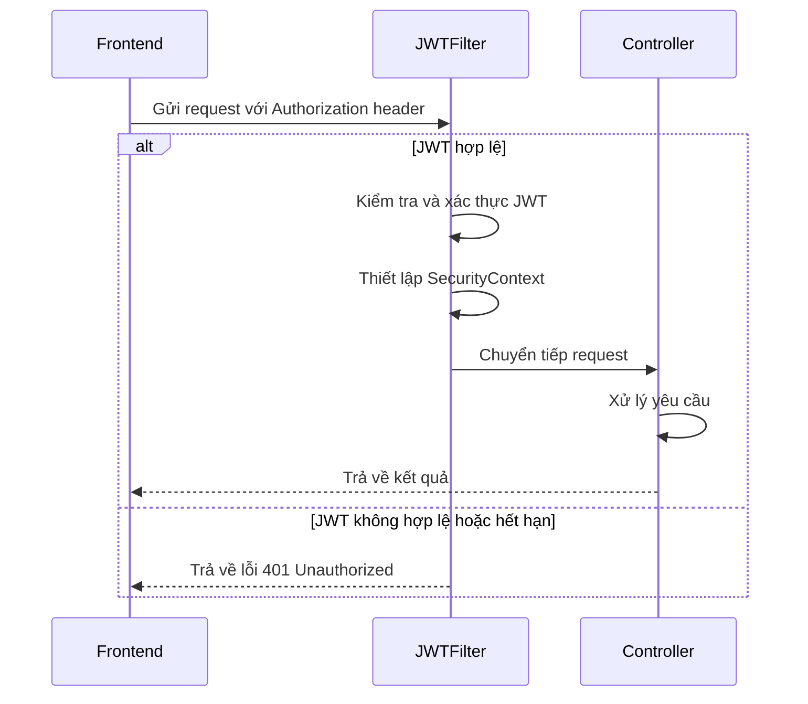
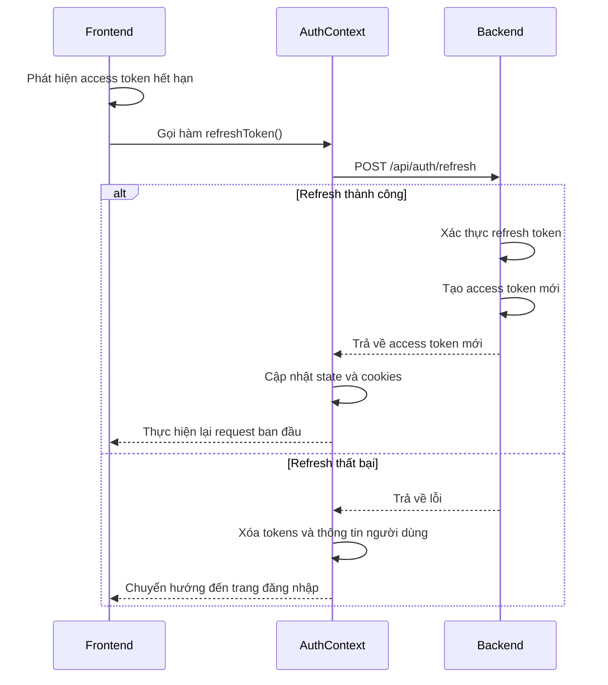

# Tài liệu Bảo trì Authentication Module

## Mục lục

1. [Tổng quan hệ thống](#1-tổng-quan-hệ-thống)
2. [Kiến trúc chi tiết](#2-kiến-trúc-chi-tiết)
3. [Luồng xác thực](#3-luồng-xác-thực)
4. [Cấu trúc mã nguồn](#4-cấu-trúc-mã-nguồn)
5. [Cấu hình hệ thống](#5-cấu-hình-hệ-thống)
6. [API Endpoints](#6-api-endpoints)
7. [Quản lý token](#7-quản-lý-token)
8. [Phân quyền](#8-phân-quyền)
9. [Bảo mật](#9-bảo-mật)
10. [Xử lý lỗi](#10-xử-lý-lỗi)
11. [Mở rộng hệ thống](#11-mở-rộng-hệ-thống)
12. [Khắc phục sự cố](#12-khắc-phục-sự-cố)
13. [Kiểm thử](#13-kiểm-thử)
14. [Tài liệu tham khảo](#14-tài-liệu-tham-khảo)


## 1. Tổng quan hệ thống

### 1.1 Giới thiệu

Authentication Module là hệ thống xác thực và phân quyền dựa trên JWT (JSON Web Token) được triển khai cho ứng dụng quản lý học sinh. Hệ thống bao gồm hai phần chính:

- **Backend**: Triển khai bằng Spring Boot, Spring Security và JWT
- **Frontend**: Triển khai bằng Next.js, React và TypeScript


### 1.2 Các tính năng chính

- Đăng nhập/đăng xuất
- Xác thực dựa trên JWT
- Phân quyền dựa trên vai trò (RBAC)
- Cơ chế refresh token
- Bảo vệ API endpoints
- Xử lý phiên đăng nhập trên nhiều tab
- Xử lý token hết hạn


### 1.3 Công nghệ sử dụng

**Backend:**

- Spring Boot 3.x
- Spring Security 6.x
- JWT (jsonwebtoken)
- JPA/Hibernate
- PostgreSQL


**Frontend:**

- Next.js 14.x
- React 18.x
- TypeScript 5.x
- Axios
- jwt-decode
- js-cookie


## 2. Kiến trúc chi tiết

### 2.1 Kiến trúc tổng thể

```plaintext
┌─────────────────┐      ┌─────────────────┐      ┌─────────────────┐
│                 │      │                 │      │                 │
│    Frontend     │◄────►│    API Layer    │◄────►│    Database     │
│    (Next.js)    │      │  (Spring Boot)  │      │  (PostgreSQL)   │
│                 │      │                 │      │                 │
└─────────────────┘      └─────────────────┘      └─────────────────┘
```

### 2.2 Kiến trúc backend

```plaintext
┌─────────────────────────────────────────────────────────────────┐
│                        Spring Boot Application                  │
│                                                                 │
│  ┌─────────────┐    ┌─────────────┐    ┌─────────────────────┐  │
│  │             │    │             │    │                     │  │
│  │ Controllers │───►│  Services   │───►│     Repositories    │  │
│  │             │    │             │    │                     │  │
│  └─────────────┘    └─────────────┘    └─────────────────────┘  │
│         │                  │                      │             │
│         ▼                  ▼                      ▼             │
│  ┌─────────────┐    ┌─────────────┐    ┌─────────────────────┐  │
│  │             │    │             │    │                     │  │
│  │ JWT Filter  │◄───│ JWT Service │    │      Entities       │  │
│  │             │    │             │    │                     │  │
│  └─────────────┘    └─────────────┘    └─────────────────────┘  │
│                                                                 │
└─────────────────────────────────────────────────────────────────┘
```

### 2.3 Kiến trúc frontend

```plaintext
┌─────────────────────────────────────────────────────────────────┐
│                        Next.js Application                      │
│                                                                 │
│  ┌─────────────┐    ┌─────────────┐    ┌─────────────────────┐  │
│  │             │    │             │    │                     │  │
│  │   Pages     │───►│ Components  │───►│     API Client      │  │
│  │             │    │             │    │                     │  │
│  └─────────────┘    └─────────────┘    └─────────────────────┘  │
│         │                  │                      │             │
│         ▼                  ▼                      ▼             │
│  ┌─────────────┐    ┌─────────────┐    ┌─────────────────────┐  │
│  │             │    │             │    │                     │  │
│  │ Middleware  │◄───│ Auth Context│───►│   Token Storage     │  │
│  │             │    │             │    │     (Cookies)       │  │
│  └─────────────┘    └─────────────┘    └─────────────────────┘  │
│                                                                 │
└─────────────────────────────────────────────────────────────────┘
```

## 3. Luồng xác thực

### 3.1 Luồng đăng nhập



### 3.2 Luồng đăng xuất



### 3.3 Luồng xác thực API



### 3.4 Luồng refresh token



## 4. Cấu trúc mã nguồn

### 4.1 Cấu trúc thư mục frontend

```
frontend/
├── app/                      # Next.js App Router
│   ├── (auth)/               # Routes không yêu cầu xác thực
│   │   ├── login/            # Trang đăng nhập
│   │   └── forgot-password/  # Trang quên mật khẩu
│   ├── (dashboard)/          # Routes yêu cầu xác thực
│   │   ├── dashboard/        # Dashboard chính
│   │   ├── students/         # Quản lý học sinh
│   │   └── ...               # Các trang khác
│   └── api/                  # API Routes
│       └── auth/             # API liên quan đến xác thực
├── components/               # React components
│   ├── auth-provider.tsx     # Provider cho Authentication Context
│   ├── logout-dialog.tsx     # Hộp thoại xác nhận đăng xuất
│   ├── protected-route.tsx   # Component bảo vệ route
│   ├── header.tsx            # Header với nút đăng xuất
│   ├── app-sidebar.tsx       # Sidebar với nút đăng xuất
│   └── user-nav.tsx          # Dropdown menu người dùng
├── lib/                      # Utilities và hooks
│   ├── auth.ts               # Authentication context và utilities
│   └── api.ts                # API client và interceptors
└── middleware.ts             # Next.js middleware cho xác thực
```

### 4.2 Các file chính

#### 4.2.1 lib/auth.ts

File này chứa context, hooks và các utility functions liên quan đến xác thực:

- AuthContext: Context cho việc quản lý state xác thực
- useAuth(): Hook để sử dụng context
- decodeToken(): Giải mã JWT để lấy thông tin người dùng
- isTokenExpired(): Kiểm tra token đã hết hạn chưa

#### 4.2.2 components/auth-provider.tsx

Provider component quản lý state xác thực và cung cấp các phương thức:

- login(): Đăng nhập người dùng
- logout(): Đăng xuất người dùng
- checkAuth(): Kiểm tra trạng thái xác thực
- refreshToken(): Làm mới access token

#### 4.2.3 middleware.ts

Next.js middleware kiểm tra xác thực cho các route:

- Kiểm tra các route công khai (public routes)
- Kiểm tra token trong cookies
- Xử lý chuyển hướng tới trang đăng nhập
- Ngăn chặn vòng lặp chuyển hướng (redirect loops)

#### 4.2.4 components/protected-route.tsx

Component bảo vệ route, kiểm tra xác thực và phân quyền:

- Kiểm tra người dùng đã đăng nhập chưa
- Kiểm tra người dùng có quyền truy cập không
- Hiển thị UI loading khi đang kiểm tra

#### 4.2.5 components/logout-dialog.tsx

Hộp thoại xác nhận đăng xuất:

- Hiển thị AlertDialog xác nhận
- Xử lý sự kiện khi người dùng xác nhận đăng xuất
- Gọi hàm logout() từ AuthContext

## 5. Cấu hình hệ thống

### 5.1 Cấu hình JWT

```env
# Thời gian sống của JWT (giây)
NEXT_PUBLIC_JWT_EXPIRATION=3600
NEXT_PUBLIC_REFRESH_TOKEN_EXPIRATION=604800

# Tên cookies
NEXT_PUBLIC_JWT_COOKIE_NAME=accessToken
NEXT_PUBLIC_REFRESH_TOKEN_COOKIE_NAME=refreshToken

# Endpoint API
NEXT_PUBLIC_API_URL=/api
NEXT_PUBLIC_API_AUTH_ENDPOINT=/auth
```

### 5.2 Cấu hình CORS

Backend cần được cấu hình CORS để cho phép requests từ frontend:

```java
@Configuration
public class CorsConfig implements WebMvcConfigurer {
    @Override
    public void addCorsMappings(CorsRegistry registry) {
        registry.addMapping("/**")
            .allowedOrigins("http://localhost:3000")
            .allowedMethods("GET", "POST", "PUT", "DELETE", "OPTIONS")
            .allowedHeaders("*")
            .allowCredentials(true);
    }
}
```

## 6. API Endpoints

### 6.1 Authentication API

| Endpoint | Method | Description | Request Body | Response |
|----------|--------|-------------|--------------|----------|
| `/api/auth/login` | POST | Đăng nhập | `{ username, password }` | `{ accessToken, refreshToken, user }` |
| `/api/auth/logout` | POST | Đăng xuất | - | `{ success: true }` |
| `/api/auth/refresh` | POST | Làm mới token | `{ refreshToken }` | `{ accessToken, refreshToken }` |
| `/api/auth/me` | GET | Lấy thông tin user | - | `{ id, username, role, ... }` |

### 6.2 Các cấu trúc dữ liệu

#### 6.2.1 User

```typescript
interface User {
  id: string;
  username: string;
  role: string;
  name?: string;
  [key: string]: any;
}
```

#### 6.2.2 AuthResponse

```typescript
interface AuthResponse {
  accessToken: string;
  refreshToken: string;
  user: User;
}
```

## 7. Quản lý token

### 7.1 Lưu trữ token

Tokens được lưu trong HTTP-only cookies để tăng cường bảo mật:

```typescript
// Lưu token vào cookies
Cookies.set(process.env.NEXT_PUBLIC_JWT_COOKIE_NAME || "accessToken", accessToken, {
  secure: process.env.NODE_ENV === "production",
  sameSite: "lax"
});

Cookies.set(process.env.NEXT_PUBLIC_REFRESH_TOKEN_COOKIE_NAME || "refreshToken", refreshToken, {
  secure: process.env.NODE_ENV === "production",
  sameSite: "lax"
});
```

### 7.2 Kiểm tra token hết hạn

```typescript
export const isTokenExpired = (token: string): boolean => {
  try {
    const decoded = jwtDecode<{ exp: number }>(token);
    const currentTime = Date.now() / 1000;
    return decoded.exp < currentTime;
  } catch {
    return true;
  }
}
```

### 7.3 Refresh token

Cơ chế tự động refresh token khi access token hết hạn:

```typescript
const refreshToken = async (): Promise<string | null> => {
  try {
    const storedRefreshToken = Cookies.get(process.env.NEXT_PUBLIC_REFRESH_TOKEN_COOKIE_NAME || "refreshToken");
    
    if (!storedRefreshToken) {
      return null;
    }
    
    const response = await apiClient.post(`${process.env.NEXT_PUBLIC_API_AUTH_ENDPOINT}/refresh`, {
      refreshToken: storedRefreshToken
    });
    
    const { accessToken, refreshToken: newRefreshToken } = response.data;

    if (accessToken) {
      Cookies.set(process.env.NEXT_PUBLIC_JWT_COOKIE_NAME || "accessToken", accessToken);
      Cookies.set(process.env.NEXT_PUBLIC_REFRESH_TOKEN_COOKIE_NAME || "refreshToken", newRefreshToken || storedRefreshToken);
      return accessToken;
    }

    return null;
  } catch (error) {
    console.error("Failed to refresh token:", error);
    return null;
  }
}
```

## 8. Phân quyền

### 8.1 Mô hình phân quyền

Hệ thống sử dụng mô hình phân quyền dựa trên vai trò (Role-Based Access Control - RBAC):

- **admin**: Toàn quyền truy cập hệ thống
- **teacher**: Quyền truy cập vào các tính năng liên quan đến giảng dạy
- **staff**: Quyền truy cập vào các tính năng hành chính

### 8.2 Phân quyền ở frontend

```typescript
// ProtectedRoute component
export function ProtectedRoute({ children, requiredRoles }: ProtectedRouteProps) {
  const { user } = useAuth();
  
  const hasRequiredRole = () => {
    if (!requiredRoles || requiredRoles.length === 0) return true;
    if (!user) return false;
    return requiredRoles.includes(user.role);
  }
  
  if (!hasRequiredRole()) {
    return <AccessDenied />;
  }
  
  return <>{children}</>;
}
```

### 8.3 Phân quyền ở backend

```java
@PreAuthorize("hasRole('ADMIN')")
@GetMapping("/admin/users")
public ResponseEntity<?> getAllUsers() {
    // ...
}

@PreAuthorize("hasAnyRole('ADMIN', 'TEACHER')")
@GetMapping("/classes")
public ResponseEntity<?> getClasses() {
    // ...
}
```

## 9. Bảo mật

### 9.1 Biện pháp bảo mật

1. **HTTP-only cookies**: Token được lưu trong HTTP-only cookies để tránh XSS attacks
2. **CSRF Protection**: Sử dụng sameSite cookie policy
3. **HTTPS**: Bắt buộc sử dụng HTTPS trong môi trường production
4. **Rate Limiting**: Giới hạn số lượng request đăng nhập để tránh brute force
5. **JWT Signature Validation**: Xác thực chữ ký JWT

### 9.2 Xử lý đăng xuất an toàn

```typescript
const logout = async (): Promise<void> => {
  try {
    // Gọi API đăng xuất
    await apiClient.post(`${process.env.NEXT_PUBLIC_API_AUTH_ENDPOINT}/logout`);
  } catch (error) {
    console.error("Logout API failed:", error);
  } finally {
    // Xóa cookies
    Cookies.remove(process.env.NEXT_PUBLIC_JWT_COOKIE_NAME || "accessToken");
    Cookies.remove(process.env.NEXT_PUBLIC_REFRESH_TOKEN_COOKIE_NAME || "refreshToken");
    
    // Xóa state
    setState({
      user: null,
      accessToken: null,
      refreshToken: null,
      isLoading: false,
      error: null,
    });

    // Chuyển hướng đến trang đăng nhập
    router.push("/login");
  }
}
```

## 10. Xử lý lỗi

### 10.1 Loại lỗi xác thực

1. **Unauthorized (401)**: Token không hợp lệ hoặc hết hạn
2. **Forbidden (403)**: Không có quyền truy cập
3. **Bad Request (400)**: Thông tin đăng nhập không đúng định dạng
4. **Internal Server Error (500)**: Lỗi server

### 10.2 Xử lý lỗi client-side

```typescript
try {
  const response = await login(username, password);
  // Xử lý thành công
} catch (error: any) {
  if (error.response) {
    switch (error.response.status) {
      case 401:
        setError("Thông tin đăng nhập không chính xác");
        break;
      case 403:
        setError("Tài khoản của bạn đã bị khóa");
        break;
      default:
        setError("Đã xảy ra lỗi. Vui lòng thử lại sau");
    }
  } else {
    setError("Không thể kết nối đến máy chủ");
  }
}
```

### 10.3 Interceptor xử lý lỗi

```typescript
apiClient.interceptors.response.use(
  (response) => response,
  async (error) => {
    const originalRequest = error.config;
    
    // Trường hợp token hết hạn
    if (error.response?.status === 401 && !originalRequest._retry) {
      originalRequest._retry = true;
      
      try {
        const newToken = await refreshToken();
        if (newToken) {
          originalRequest.headers['Authorization'] = `Bearer ${newToken}`;
          return apiClient(originalRequest);
        }
      } catch (refreshError) {
        // Xử lý khi refresh token thất bại
      }
    }
    
    return Promise.reject(error);
  }
);
```

## 11. Tính năng đăng xuất

### 11.1 Thành phần UI đăng xuất

Hệ thống cung cấp nhiều điểm truy cập để đăng xuất:

1. **Nút đăng xuất trong header**: Nút trực quan với biểu tượng và tooltip
2. **Nút đăng xuất trong sidebar**: Ở phía dưới thông tin người dùng
3. **Tùy chọn đăng xuất trong dropdown profile**: Trong menu người dùng

### 11.2 Hộp thoại xác nhận đăng xuất

```tsx
export function LogoutDialog({ isOpen, onOpenChange }: LogoutDialogProps) {
  const { logout } = useAuth();

  const handleConfirmLogout = async () => {
    await logout();
    onOpenChange(false);
  };

  return (
    <AlertDialog open={isOpen} onOpenChange={onOpenChange}>
      <AlertDialogContent>
        <AlertDialogHeader>
          <AlertDialogTitle>Xác nhận đăng xuất</AlertDialogTitle>
          <AlertDialogDescription>
            Bạn có chắc chắn muốn đăng xuất khỏi hệ thống không?
          </AlertDialogDescription>
        </AlertDialogHeader>
        <AlertDialogFooter>
          <AlertDialogCancel>Hủy</AlertDialogCancel>
          <AlertDialogAction onClick={handleConfirmLogout} className="bg-red-500 hover:bg-red-600">
            Đăng xuất
          </AlertDialogAction>
        </AlertDialogFooter>
      </AlertDialogContent>
    </AlertDialog>
  );
}
```

### 11.3 Tích hợp nút đăng xuất vào header

```tsx
// Trong component Header
const [isLogoutDialogOpen, setIsLogoutDialogOpen] = useState(false);

// ...

<TooltipProvider>
  <Tooltip>
    <TooltipTrigger asChild>
      <Button 
        variant="outline" 
        size="sm" 
        className="mr-2 text-red-500 border-red-200 hover:bg-red-50 hover:text-red-600 hover:border-red-300 flex items-center gap-1"
        onClick={() => setIsLogoutDialogOpen(true)}
      >
        <LogOut className="h-4 w-4" />
        <span className="hidden sm:inline">Đăng xuất</span>
      </Button>
    </TooltipTrigger>
    <TooltipContent>
      <p>Đăng xuất</p>
    </TooltipContent>
  </Tooltip>
</TooltipProvider>

<LogoutDialog isOpen={isLogoutDialogOpen} onOpenChange={setIsLogoutDialogOpen} />
```

## 12. Khắc phục sự cố

### 12.1 Vấn đề vòng lặp chuyển hướng

**Vấn đề**: Trong version trước, hệ thống bị vòng lặp vô hạn giữa middleware và ProtectedRoute component

**Giải pháp**:
1. Cải tiến middleware để phát hiện và ngăn chặn vòng lặp redirect
2. Đơn giản hóa ProtectedRoute để không gọi checkAuth() trong useEffect
3. Sử dụng cờ isVerifying để tránh nhiều lần redirect

```typescript
// Trong middleware.ts
// Phát hiện và ngăn chặn vòng lặp redirect
const referer = request.headers.get("referer") || "";
if (referer.includes("/login") && referer.includes(request.url)) {
  console.error("Redirect loop detected:", referer, "->", request.url);
  return NextResponse.next();
}
```

### 12.2 Vấn đề logout không hoàn toàn

**Vấn đề**: Đôi khi đăng xuất không xóa hết dữ liệu phiên làm việc

**Giải pháp**:
1. Thêm try-finally block để đảm bảo cookies được xóa ngay cả khi API đăng xuất thất bại
2. Sử dụng hàm Cookies.remove() thay vì localStorage để xóa token
3. Đảm bảo router.push() được gọi sau khi xóa state và cookies

### 12.3 Kiểm tra trạng thái xác thực

Để debug trạng thái xác thực:

1. **Kiểm tra cookies**:
```javascript
// Trong console browser
document.cookie
```

2. **Kiểm tra local AuthContext**:
```javascript
// Thêm console.log trong AuthProvider
useEffect(() => {
  console.log("AuthState:", state);
}, [state]);
```

## 13. Kiểm thử

### 13.1 Kiểm thử đăng nhập

1. Mở trang đăng nhập
2. Nhập thông tin đăng nhập
3. Kiểm tra chuyển hướng đến dashboard
4. Kiểm tra thông tin người dùng hiển thị đúng

### 13.2 Kiểm thử đăng xuất

1. Đăng nhập vào hệ thống
2. Nhấp vào nút đăng xuất trên header
3. Xác nhận đăng xuất trong hộp thoại
4. Kiểm tra chuyển hướng đến trang đăng nhập
5. Kiểm tra không thể truy cập các trang bảo vệ

### 13.3 Kiểm thử refresh token

1. Đăng nhập vào hệ thống
2. Chỉnh sửa cookie để làm access token hết hạn
3. Thực hiện một action yêu cầu xác thực
4. Kiểm tra hệ thống tự động refresh token
5. Kiểm tra action được thực hiện thành công

## 14. Tài liệu tham khảo

- [JWT.io](https://jwt.io/) - Tìm hiểu về JWT
- [Next.js Authentication](https://nextjs.org/docs/authentication) - Hướng dẫn xác thực Next.js
- [Spring Security JWT](https://www.baeldung.com/spring-security-oauth-jwt) - Triển khai JWT với Spring Security
- [React Context API](https://reactjs.org/docs/context.html) - Tài liệu về Context API
- [HTTP Cookies](https://developer.mozilla.org/en-US/docs/Web/HTTP/Cookies) - Tài liệu về HTTP Cookies